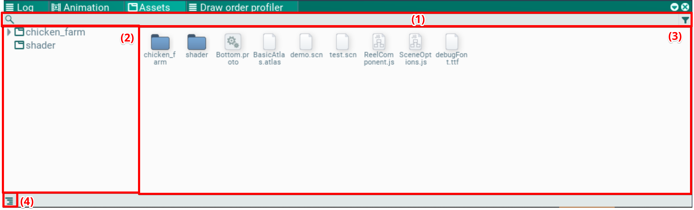
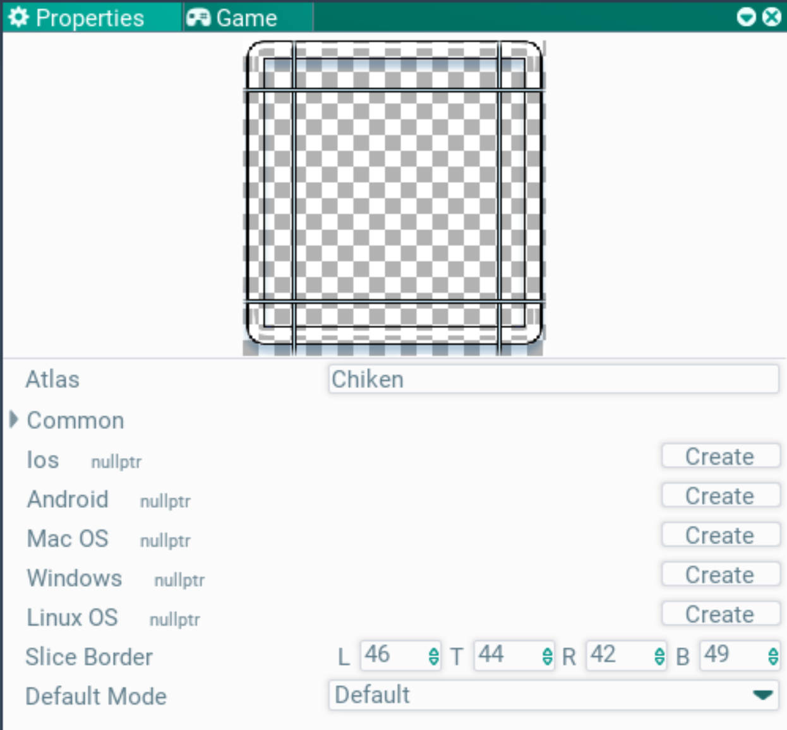
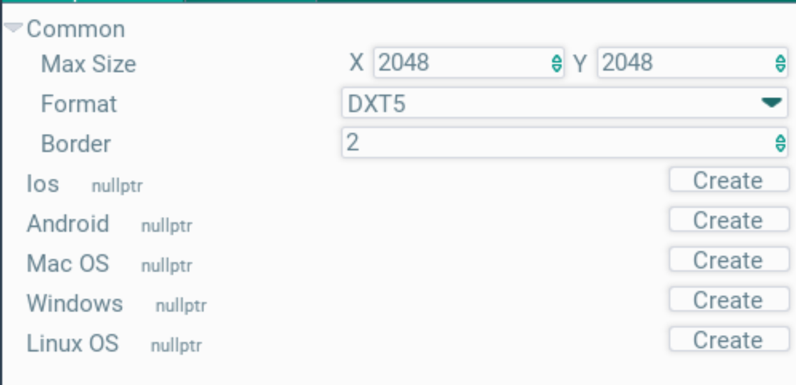

## Assets. Окно ассетов

В этом окне можно увидеть ассеты, которые есть в игре, отредактировать их или "вытащить" на сцену.

Слева в окне отображена иерархия папок (2). Выбрав папку, в окне файлов (3) покажутся ассеты в выбранной папке. По кнопке (4) можно включать и выключать отображение папок.

Сверху есть фильтр для поиска по имени (1).

Ассеты и папки можно перемещать с помощью drag'n'drop в папки. Можно копировать, вставлять и удалять. Функционал практически аналогичен типичному обозревателю файлов в ОС.

Создавать новые ассеты можно через контекстное меню, пункт Create.

По клику на ассет его можно выделить, и тогда в окне Properties покажутся его настройки. Там, например, можно изменять параметры атласов и текстур, стили шрифтов.

Для некоторых типов ассетов работает drag'n'drop в иерархию или сцену: текстуры и прототипы. Для этого их просто нужно перетащить в нужное место.

### Настройка текстур и атласов

Выбрав нужный атлас или текстуру можно настроить их параметры. настройки отобразятся в окне Properties. Как только выделение с файла будет снято - он будет автоматически созранен (будет изменено на ручное сохранение)

При выборе текстуры отображается ее превью, поверх которого можно отредактировать отступы для 9-slice спрайта.

В поле Atlas задается ссылка на атлас, в который попадет текстура. Чтобы задать атлас, нужно его перетащить drg'n'drop-ом в это поле из окна ассетов.

При выборе атласа показываются его параметры, так же в окне Properties.

В нем есть общие настройки атласа (Common) и платформо-зависимые (вам это не нужно по идее). Внутри общих настроек можно задать максимальный размер страницы атласа (может быть упакован в несколько страниц), формат сжатия и отступы для текстур при упаковке.
