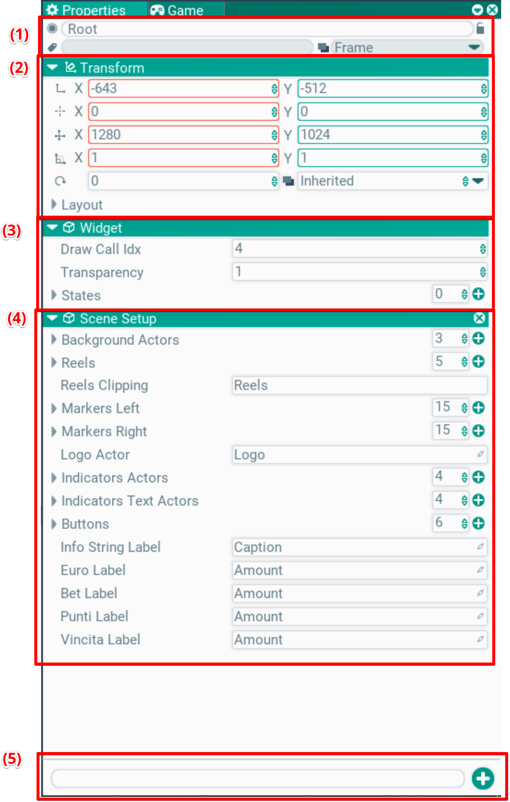

## Properties. Окно настроек

В этом окне происходит настройка выбранной сущности. Это может быть ассет, какие-либо настройки или актор. на скриншоте показан пример актора с типом Widget.

Особенностбю является возможность редактирования нескольких выбранных сущностей сразу. В таком случае редактор пытается отобращить общие поля и общие значения. Если он не находит общего, или эти значения различаются, то ничего не отображается или показывается прочерк вместо значения

Редактор умеет показывать много типов полей, включая пользовательские:
- числа, строки, bool, enum
- массивы
- вложенные объекты по значению
- вложенные обхекты по указателю. Доступно удаление и создание с выбором типа
- ссылки на другие акторы. Назначаются через drag'n'drop из иерархии
- ссылки на ассеты. Назначаются через drag'n'drop из окна ассетов, либо создаются inplace. Это значит ассет сохраняется вместе с актором.

### (1) Заголовок
Здесь отображена основная информация по актору - активность (кружок слева сверху), имя, теги, слой, залочка. Все эти контролы доступны для редактирования.

### (2) Трансформация
Здесь отображаются параметры локальной трансформации выбранного актора:
- Позиция
- Pivot
- Размеры
- Скейл
- Поворот и слой
- Layout: настройка динамической верстки для виджетов

### (3) Настройки актора
Если редактируется не сам o2::Actor, а его наследник, тогда показываются его параметры. На примере в скриншоте показан коэффициент прозрачности и список состояний виджета.

Настройки берутся их актора через рефлексию. По умолчанию показываются все публичные поля. Так же отмеченные специальным тегом в коде

### (4) Компоненты
Далее списокм поблочно показаны параметры компонентов. Точно так же показываются публичные поля, заданные в компоненте.

Через крестик можно удалить компонент

### (5) Меню добавления компоненты
По клику в это меню оно раскрывается, внутри показано дерево компонент. Через строку ввода можно отфильтровать по имени. По дабл-клику или клавише Enter выбранный тип компонента добавляется на выбранный актор

