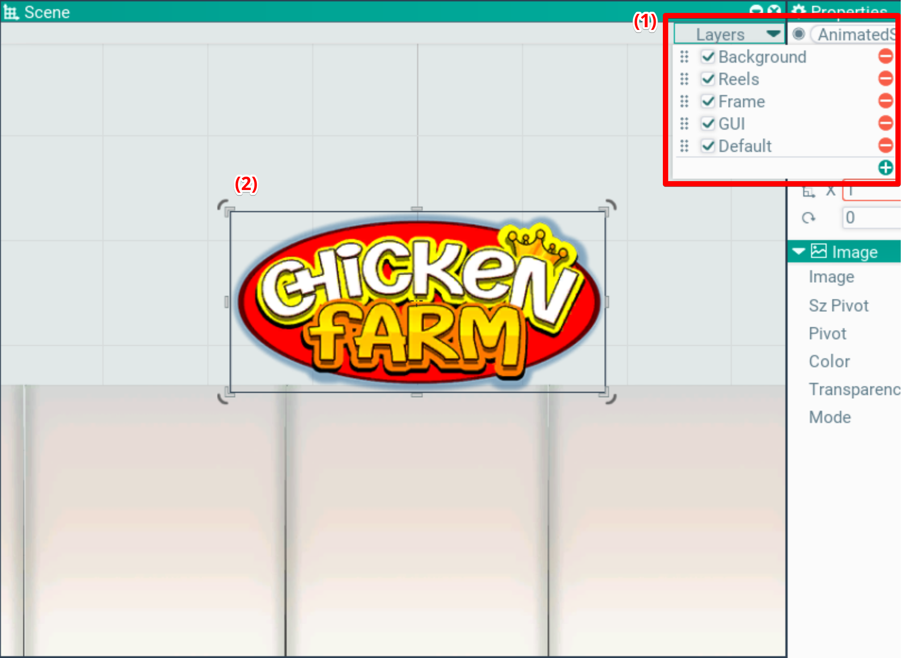

## Scene. Окно сцены

В этом окне отображаются акторы на сцене в порядке расположения на слоях, вне зависимости от камеры. Сцену можно скроллить и зумить. Скролл через зажатую левую кнопку мыши, зум колесиком.

на фоне нарисована сетка, которая показывает кратные 10ти юниты сцены.

Левой кнопкой мыши можно выбирать акторы. Если кликать в одну точку, выбор происходит циклически от верхнего к нижнему. Таким образом можно выбрать нужную ноду в иерархии кликнув несколько раз.

Так же отображается активный тул (2), выбранный в тулбаре. Он интерактивный, работает так же как и в других редакторах.

У активного тула может включаться специальный режим через зажатике клавиш Shift/Ctrl/Alt. Среди них - снеппинг, выравнивание по осям и др.

### Слои
В окне сцены можно настроить слои и их порядок. Для этого нужно кликнуть Layers сверху (1).

В выпадающем меню можно их пересортировать через drag'n'drop, создать новый, удалить старый, переименовать слой через дабл-клик, включить/выключить галкой.