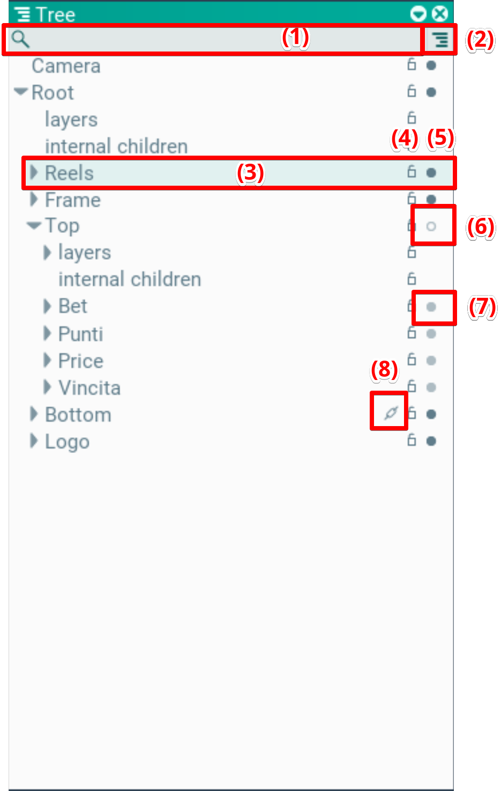
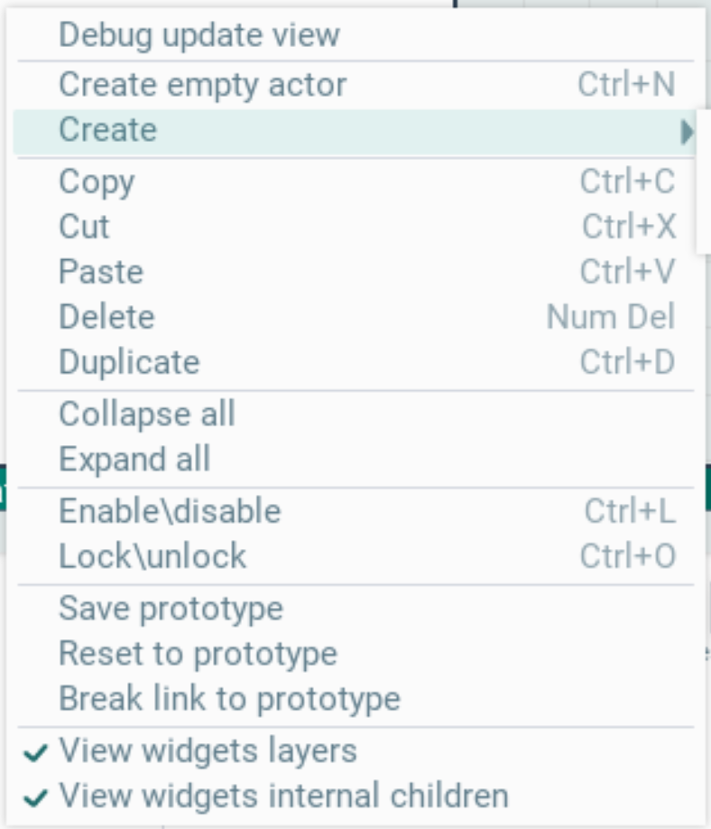
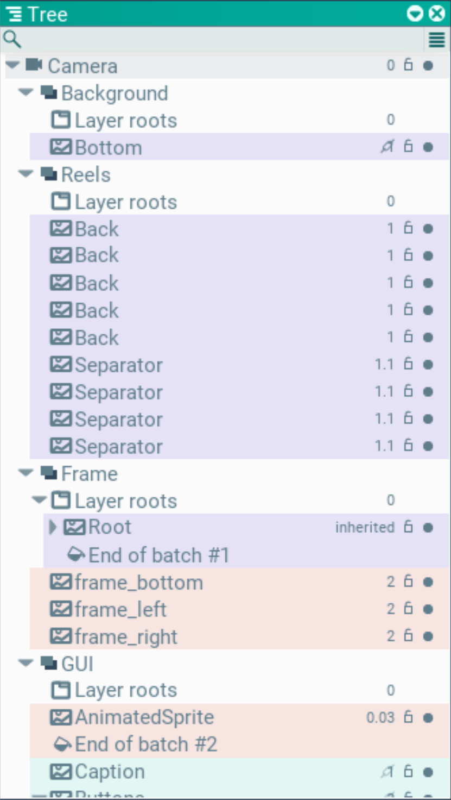

## Tree. Окно иерахии

Окно иерархии может работать в двух режимах: иерархия сцены и порядок отрисовки. режимы переключаются по кнопке (2).

### Режим сцены:

Основная часть окна - это иерархия сцены. Каждая строка - отдельный актор. Сверху есть фильтр по имени (1).

В строке каждого актора (3) отображается его имя, которое можно редактировать по дабл-клику.

Так же отображается его активность (5). Яркий заполненный кружок - нода активна. Пустой тусклый кружок (6) - нода не активна. Полный, но тусклый кружок (7) - сама нода активна, но тк кто-то из ее родителей не активен, она считается не кативной.

Залочка выбора в сцене (4). Иногда полезно отключать выбор в сцене для некоторых частей иерархии, чтобы они не мешались.

Так же может быть отображен значок звена цепи (8) - это значит что актор создан из прототипа. По клику на эту иконку, в окне Assets подсветится прототип

Акторы можно перетаскивать через drag'n'drop. Для этого нужно зажать мышкой нужный актор (или несколько) и начать перемещать. Наведя на нужно место нужно отпустить мышку.

При нажатии правой кнопки мыши откроется контекстное меню. В нем обозначены хоткеи на доступные действия. Для их работы окно Tree или Scene должны быть в фокусе. Если они в фокусе - то выбранные акторы подсечиваются зеленым цветом, иначе серым.

Через контекстное меню можно создавать новые акторы. Для этого можно выбрать Create empty actor, для создания пустого актора, либо выбрать нужный тип через меню Create.

### Режим порядка отрисовки

В этом режиме отображается иерархия отрисовки и ее порядок. На первом уровне показан список камер. В данном примере она одна - Camera.

Внутри каждой камеры есть слои, в порядке их отрисовки - Background, Reels, Frame, GUI.

Внутри слоев отсортированный список рисуемых сущностей, с приоритетом в конце строки. С 0-м приоритетом всегда отображается Layer roots - это контейнер обхектов, у которых не установлен числовой приоритет.

Эти сущности тоже могут содержат в себе сущности, если они наследуют приоритет отрисовки от родителя.

Цветом отмечены раздельные батчи, в конце которых добавляется строка End of batch #N, где N - это номер батча

Для изменения очередности отрисовки можно перемещать объекты через drag'n'drop.