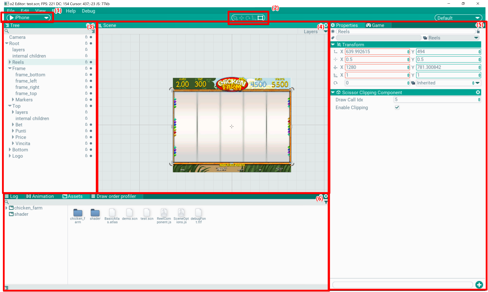

## Редактор

Редактор - это место, где верстается сцена и создается контент для игры. 

В нем есть внутренние окна, которые могут быть прикреплены друг другу, а так же вложены в несколько вкладок. Эти окна можно перемещать, прицеплять к другим окнам (таскать за заголовок окна) и складывать во вкладки (дабл-клик в заголовок).

Редактор может работать в двух режимах: редактирование и игра. В первом режиме сцена загружена, но не получает апдейт и как бы находится в статичном состоянии. В таком режиме ее можно редактировать и сохранять. Во втором режиме - режиме игры - можно проверить работу сцены, все отображаются в редакторе, но происходит обновление и обрабатывает инпут в окне игры. В это время сцену сохранять нельзя.

Рассмотрим окна и элементы, которые есть в редакторе в раскладке по умолчанию:

- (1) панель запуска сцены. При нажатии на Play оно разворачивается и позволяет поставить игру на паузу и проиграть один кадр. Выпадающий список не функционален, подразумевает запуск на других устройствах.

- (2) панель утилит. Выбирается активный тул, который переключает режим редактирования в сцене

- (3) [Tree](/Docs/ru/Editor/Tree/tree.md). Окно иерархии сцены. Показыввает акторы и их детей в сцене

- (4) [Scene](/Docs/ru/Editor/Scene/scene.md). Окно редактирования сцены

- (5) [Properties](/Docs/ru/Editor/Properties/properties.md). Окно настроек выбранного объекта

- (5) [Game](/Docs/ru/Editor/Game/game.md). Окно игры, эмулирует вывод графики и обработку ввода как будто приложение запущено отдельно

- (6) [Assets](/Docs/ru/Editor/Assets/assets.md). Окно ассетов, в нем можно перемещать, редактировать и просматривать ассеты

- (6) [Log](/Docs/ru/Editor/Log/log.md). Окно лога, в него выводятся отладочные сообщения

- (6) [Animation](/Docs/ru/Editor/Animation/animation.md). Редактор анимации, в нем редактируются ключи, параметры и кривые